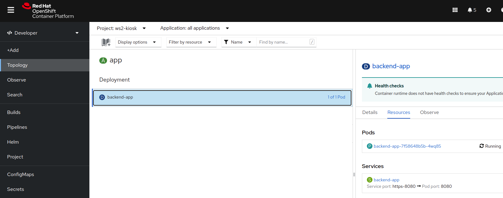

# Déploiement du composant du backend (nodejs)

1. Dans votre poste de travail, créer un dossier pour sauvegarder le code des composants et allez dans ce dossier créé.
    ```bash
    mkdir kiosk
    cd kiosk
    ```

2. Obtenir le code du backend à partir de son dépôt Git et allez dans le dossier créé:
    ```bash
    git clone https://github.com/RedHatWorkshops/openshiftv4-odo-workshop-backend.git
    cd openshiftv4-odo-workshop-backend/
    ```

3. Dans un terminal (interface de ligne de commandes), [Se connecter au cluster d'Openshift](../../Outils/ODO/README.md#se-connecter-au-cluster-dopenshift)
   

4. Utilisez odo pour le "build" et le déploiement du composant du backend
    
    Vérifiez que vous vous trouvez connecté au bon projet d'Openshift.
    ```bash
    odo project get
    ```
    *Si vous n'êtes pas au bon projet, alors allez au projet de travail en cours avec la commande `set`.
    ```bash
    odo project set myproject
    ```
    Créez le composant backend à partir du code qui a été rammené du dépôt Git:
    ```bash
    odo create nodejs backend
    ```
    résultat:
    ```bash
    Devfile Object Creation
    ✓  Checking if the devfile for "nodejs" exists on available registries [95216ns]
    ✓  Creating a devfile component from registry "DefaultDevfileRegistry" [525ms]
    Validation
    ✓  Validating if devfile name is correct [38322ns]
    ✓  Validating the devfile for odo [7ms]
    ✓  Updating the devfile with component name "backend" [1ms]

    Please use `odo push` command to create the component with source deployed
    ```
    Un ficher devfile.yaml a été créé avec les informations nécessaires pour le déploiement dans Openshift. Vous pouvez le vérifier dans le répertoire du backend.
    
   
5. Modifiez le port généré dans le fichier devfile.yaml
   Dans VS Code ou votre éditeur de code, ouvrez le fichier devfile.yaml et éditez-le en remplaçant la valeur 3000 par 8080 pour le conteneur:

   avant:
   ```yaml
    components:
    - container:
        endpoints:
        - name: http-3000
        targetPort: 3000    
   ```
   après:
   ```yaml
    components:
    - container:
        endpoints:
        - name: https-8080
        targetPort: 8080     
   ```

6. Poussez la création du projet au cluster d'Openshift avec `odo push`:
    ```bash
    odo push
    ```
    résultat:
    ```bash
    Validation
    ✓  Validating the devfile [56773ns]

    Creating Services for component backend
    ✓  Services are in sync with the cluster, no changes are required

    Creating Kubernetes resources for component backend
    ✓  Waiting for component to start [4s]
    ✓  Links are in sync with the cluster, no changes are required
    ✓  Waiting for component to start [10ms]

    Applying URL changes
    ✓  URL https-8080: http://https-8080-410c06ba-ws2-kiosk.apps.exp.openshift.cqen.ca/ created

    Syncing to component backend
    ✓  Checking files for pushing [1ms]
    ✓  Syncing files to the component [390ms]

    Executing devfile commands for component backend
    ✓  Executing install command "npm install" [5s]
    ✓  Executing run command "npm start" [1s]

    Pushing devfile component "backend"
    ✓  Changes successfully pushed to component
    ```

7. Vérifiez le log et assurez vous que l'application a commencé correctement:
    ```bash
    odo log backend
    ```
    résultat:
    ```bash
    time="2022-07-13T16:03:29Z" level=info msg="create process:debugrun" 
    time="2022-07-13T16:03:29Z" level=info msg="create process:devrun" 
    time="2022-07-13T16:03:29Z" level=info msg="try to start program" program=devrun 
    time="2022-07-13T16:03:29Z" level=info msg="success to start program" program=devrun 
    time="2022-07-13T16:03:30Z" level=debug msg="wait program exit" program=devrun 
    time="2022-07-13T16:03:30Z" level=info msg="program stopped with status:exit status 0" program=devrun 
    time="2022-07-13T16:03:30Z" level=info msg="Don't start the stopped program because its autorestart flag is false" program=devrun 
    time="2022-07-13T16:03:31Z" level=debug msg="no auth required" 
    time="2022-07-13T16:03:35Z" level=debug msg="no auth required" 
    time="2022-07-13T16:03:35Z" level=debug msg="succeed to find process:devrun" 
    time="2022-07-13T16:03:35Z" level=info msg="try to start program" program=devrun 
    time="2022-07-13T16:03:35Z" level=info msg="success to start program" program=devrun 
    ODO_COMMAND_RUN is npm start
    Changing directory to ${PROJECT_SOURCE}
    Executing command cd ${PROJECT_SOURCE} && npm start

    > wait-tracker-backend@1.0.0 start
    > node index.js

    Concession Kiosk Backend started on: 0.0.0.0:8080
    (node:78) Warning: Accessing non-existent property 'count' of module exports inside circular dependency
    (Use `node --trace-warnings ...` to show where the warning was created)
    (node:78) Warning: Accessing non-existent property 'findOne' of module exports inside circular dependency
    (node:78) Warning: Accessing non-existent property 'remove' of module exports inside circular dependency
    (node:78) Warning: Accessing non-existent property 'updateOne' of module exports inside circular dependency
    time="2022-07-13T16:03:36Z" level=debug msg="wait program exit" program=devrun 
    time="2022-07-13T16:03:38Z" level=debug msg="no auth required" 
    ```
8. Si vous vous connectez à la console web d'Openshift, vous pouvez vérifier le déploiement du composant backend 
dans la vue "Topology":
 - Vue par défaut:
    
 - Vue graphique: cliquez sur "Graph view" dans l'icone en haut à droite de l'écran:
    
   
    

[Table de matières](README.md)