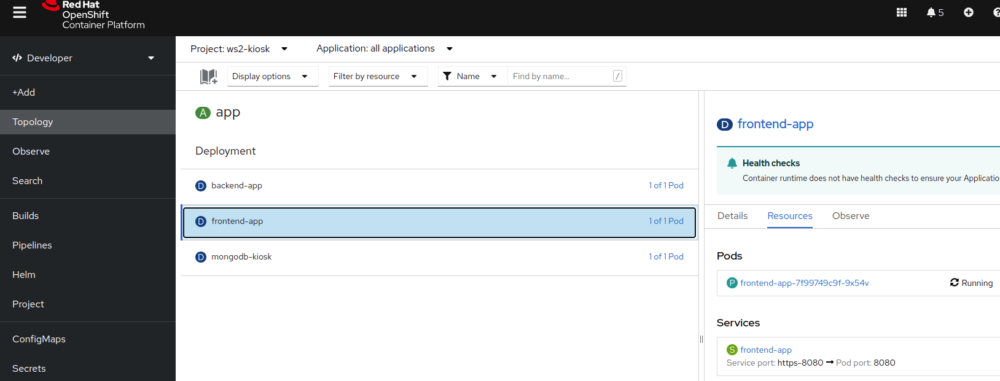
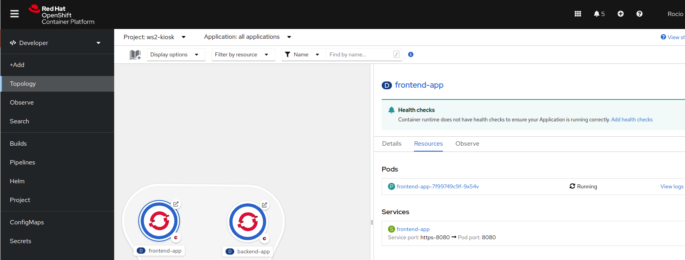
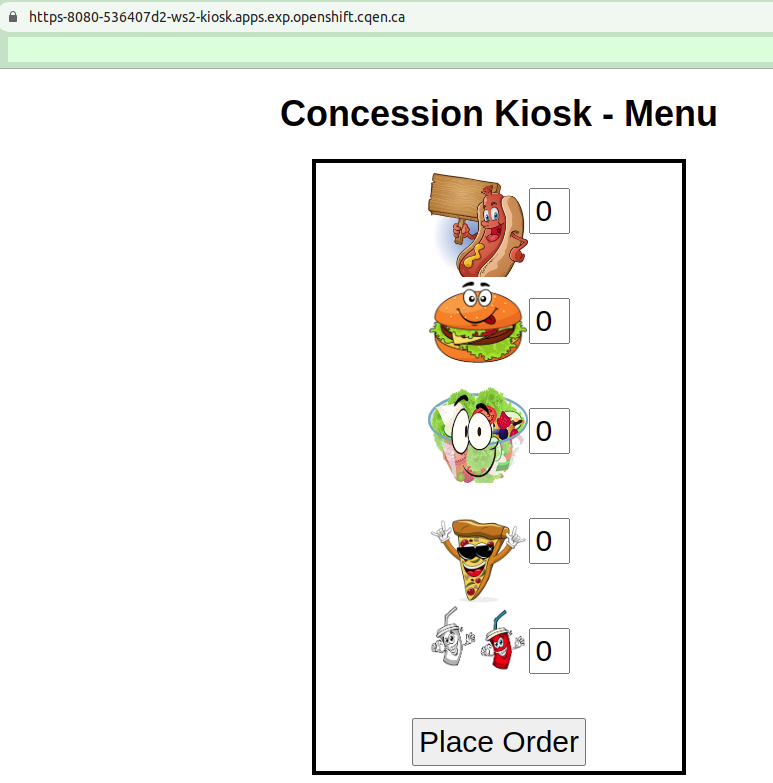

# Déploiement du composant du frontend (nodejs)

1. Dans le terminal, assurez vous d'aller au dossier parent du projet, dossier "kiosk" créé dans l'étape précédente:
    ```bash
    cd ..
    ```
2. Obtenir le code du frontend à partir de son dépôt Git et allez dans le dossier créé:
    ```bash
    git clone https://github.com/RedHatWorkshops/openshiftv4-odo-workshop.git
    cd openshiftv4-odo-workshop/
    ```
3. Si vous êtes déconnecté du cluster: [Se connecter au cluster d'Openshift](../../Outils/ODO/README.md#se-connecter-au-cluster-dopenshift)
   

4. Utilisez odo pour le "build" et le déploiement du composant du frontend
    Vérifiez que vous vous trouvez connecté au bon projet d'Openshift.
    ```bash
    odo project get
    ```
    *Si vous n'êtes pas au bon projet, alors allez au projet de travail en cours avec la commande `set`.
    ```bash
    odo project set myproject
    ```
    Créez le composant frontend à partir du code qui a été rammené du dépôt Git:
    ```bash
    odo create nodejs frontend
    ```
    résultat:
    ```bash
    Devfile Object Creation
    ✓  Checking if the devfile for "nodejs" exists on available registries [89367ns]
    ✓  Creating a devfile component from registry "DefaultDevfileRegistry" [1s]
    Validation
    ✓  Validating if devfile name is correct [121882ns]
    ✓  Validating the devfile for odo [4ms]
    ✓  Updating the devfile with component name "frontend" [290736ns]

    Please use `odo push` command to create the component with source deployed
    ```
    Un ficher devfile.yaml a été créé avec les informations nécessaires pour le déploiement dans Openshift. Vous pouvez le vérifier dans le répertoire du frontend.
   
5. Modifiez le port généré dans le fichier devfile.yaml

   Dans VS Code ou votre éditeur de code, ouvrez le fichier devfile.yaml et éditez-le en remplaçant la valeur 3000 par 8080 pour le conteneur:

   avant:
   ```yaml
    components:
    - container:
        endpoints:
        - name: http-3000
        targetPort: 3000    
   ```
   Après:
   ```yaml
    components:
    - container:
        endpoints:
        - name: https-8080
        targetPort: 8080     
   ```

6. Poussez la création du projet au cluster d'Openshift avec `odo push`:
    ```bash
    odo push
    ```
    Résultat:
    ```bash
    Validation
    ✓  Validating the devfile [63384ns]

    Creating Services for component frontend
    ✓  Services are in sync with the cluster, no changes are required

    Creating Kubernetes resources for component frontend
    ✓  Waiting for component to start [5s]
    ✓  Links are in sync with the cluster, no changes are required
    ✓  Waiting for component to start [7ms]

    Applying URL changes
    ✓  URL https-8080: http://https-8080-4a00075f-ws2-kiosk.apps.exp.openshift.cqen.ca/ created

    Syncing to component frontend
    ✓  Checking files for pushing [1ms]
    ✓  Syncing files to the component [3s]

    Executing devfile commands for component frontend
    ✓  Executing install command "npm install" [8s]
    ✓  Executing run command "npm start" [1s]

    Pushing devfile component "frontend"
    ✓  Changes successfully pushed to component
    ```
7. Vérifiez le log et assurez vous que l'application a commencé correctement:
    ```bash
    odo log frontend
    ```
    résultat:
    ```bash
    time="2022-07-11T15:12:52Z" level=info msg="create process:devrun" 
    time="2022-07-11T15:12:52Z" level=info msg="create process:debugrun" 
    time="2022-07-11T15:12:52Z" level=info msg="try to start program" program=devrun 
    time="2022-07-11T15:12:52Z" level=info msg="success to start program" program=devrun 
    time="2022-07-11T15:12:53Z" level=debug msg="wait program exit" program=devrun 
    time="2022-07-11T15:12:53Z" level=info msg="program stopped with status:exit status 0" program=devrun 
    time="2022-07-11T15:12:53Z" level=info msg="Don't start the stopped program because its autorestart flag is false" program=devrun 
    time="2022-07-11T15:12:56Z" level=debug msg="no auth required" 
    time="2022-07-11T15:13:04Z" level=debug msg="no auth required" 
    time="2022-07-11T15:13:04Z" level=debug msg="succeed to find process:devrun" 
    time="2022-07-11T15:13:04Z" level=info msg="try to start program" program=devrun 
    time="2022-07-11T15:13:04Z" level=info msg="success to start program" program=devrun 
    ODO_COMMAND_RUN is npm start
    Changing directory to ${PROJECT_SOURCE}
    Executing command cd ${PROJECT_SOURCE} && npm start

    > wait-tracker-frontend@0.0.0 start
    > node ./bin/www

    time="2022-07-11T15:13:05Z" level=debug msg="wait program exit" program=devrun 
    time="2022-07-11T15:13:06Z" level=debug msg="no auth required" 
    GET / 200 16.489 ms - 1153
    GET /stylesheets/style.css 200 7.871 ms - 827
    GET /images/hotdog.jpg 200 3.778 ms - 33360
    GET /images/pizza.jpg 200 4.788 ms - 19946
    GET /images/soda.jpg 200 4.944 ms - 27835
    GET /images/hamburger.jpg 200 2.906 ms - 357337
    GET /images/salad.jpg 200 3.407 ms - 331982
    GET /favicon.ico 404 2.678 ms - 793
    ```

8. Dans la console web d'Openshift, vous pouvez vérifier le déploiement du composant frontend dans la vue "Topology":

   - Vue par défaut:
        
   - Vue graphique: cliquez sur "Graph view" dans l'icone en haut à droite de l'écran:
        

        

9.  Entre les ressources créées pour le composant du frontend, il y a la route qui contient le lien pour accèder à l'application via web à l'extérieur d'Openshift.
   
   :warning:Pour sécuriser l'accès à l'application, il faut [ajouter le protocole TLS (Transport Layer Security) à la route](../Commun/Ajout-Securite-SSL-a-LApplication.md).

11. Cliquez sur l'URL https de la route modifié et vous allez voir la page initiale de l'application pour faire la commande:
   


[Table de matières](README.md)