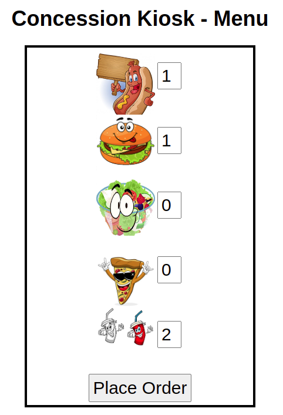

# Lier le composant frontend au backend

Maintenant que les composants frontend et backend ont été déployés, il faut s'assurer que le frontend utilise le service de backend pour compléter la commande.

1. Liez les deux composants: Dans le terminal, allez au répertoire du frontend (si vous n'êtes pas là), et utilisez la commande `odo link` pour créer le lien voulu:
    ```bash
    odo link backend
    ```
    résultat:
    ```bash
    ✓  Successfully created link between component "frontend" and component "backend"

    To apply the link, please use `odo push`
    ```
    Poussez les changements au cluster d'Openshift:
    ```bash
    odo push
    ```
    résultat:
    ```bash
    Validation
    ✓  Validating the devfile [74605ns]

    Creating Services for component frontend

    Creating Kubernetes resources for component frontend
    ✓  Waiting for component to start [12ms]
    ✓  Created link "frontend-backend-app" on the cluster; component will be restarted
    ✓  Restarting the component [2s]
    ✓  Waiting for component to start [5s]

    Applying URL changes
    ✓  URL http-8080 successfully deleted
    ✓  URL http-8080: http://http-8080-4a00075f-ws2-kiosk.apps.exp.openshift.cqen.ca/ created

    Syncing to component frontend
    ✓  Checking file changes for pushing [4ms]
    ✓  Syncing files to the component [3s]

    Executing devfile commands for component frontend
    ✓  Executing install command "npm install" [8s]
    ✓  Executing run command "npm start" [1s]

    Pushing devfile component "frontend"
    ✓  Changes successfully pushed to component
    ```
    L'information de la configuration du composant de backend est ajoutée au frontend, et ensuite, il est redémarré.

2. Modifiez la route dans Openshift: Comme la route a été re-créée, il faut l'[ajouter le protocole TLS (Transport Layer Security)](../Commun/Ajout-Securite-SSL-a-LApplication.md) dans la console web d'Openshift.
   
3. Ajoutez les variables d'environnement: Le composant du frontend utilise deux variables d'environnement (dans le fichier routes/index.js):
   - COMPONENT_BACKEND_HOST
   - COMPONENT_BACKEND_PORT
  
    Il faut ajouter ces variables d'environnement dans le fichier devfile.yaml:
    ```bash
    odo config set --env COMPONENT_BACKEND_HOST=backend-app --env COMPONENT_BACKEND_PORT=8080
    ```
    résultat:
    ```bash
    ✓  Environment variables were successfully updated
        Run `odo push` command to apply changes to the cluster
    ```
    Poussez les changements au cluster d'Openshift:
    ```bash
    odo push
    ```
    résultat:
    ```bash
    Validation
    ✓  Validating the devfile [76538ns]

    Creating Services for component frontend

    Creating Kubernetes resources for component frontend
    ✓  Waiting for component to start [18s]
    ✓  Links are in sync with the cluster, no changes are required
    ✓  Waiting for component to start [9ms]

    Applying URL changes
    ✓  URL https-8080 successfully deleted
    ✓  URL https-8080: http://https-8080-536407d2-ws2-kiosk.apps.exp.openshift.cqen.ca/ created

    Syncing to component frontend
    ✓  Checking file changes for pushing [1ms]
    ✓  Syncing files to the component [3s]

    Executing devfile commands for component frontend
    ✓  Executing install command "npm install" [8s]
    ✓  Executing run command "npm start" [1s]

    Pushing devfile component "frontend"
    ✓  Changes successfully pushed to component
    ```    

4. Tester l'application
    Ouvrez le lien du frontend dans le navigateur web, faites votre commande.
    

    Cliquez sur "Place Order" pour soumettre la commande.

    Vous devriez voir un résultat similaire:
    

[Table de matières](README.md)