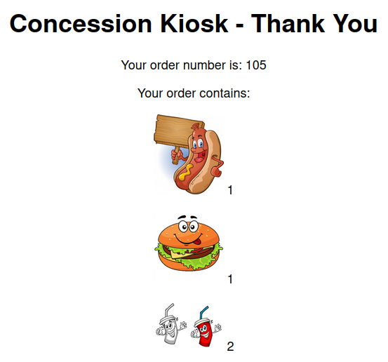
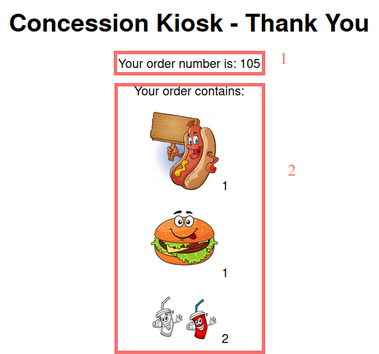

# Tester l'ensemble

Dans les étapes précédentes, vous avez déployé les trois composants (frontend, backend et la base de données mongodb). Maintenant, nous allons vérifier que le résultat final affiche le numéro de la commande et le détail de la commande (stoqué dans la base de données).

Accédez à la page web de l'application à partir du lien du composant  frontend:

Faites votre commande et cliquez sur "Place Order"

Vous devriez voir un résultat similaire:

Donc, vous pouvez constater que dans cet exemple:
- Une commande s'est faite: 1 sandwich au hotdog, 1 hamburguer et 2 boissons.
- Quand vous avez cliqué sur "Place Order", la commande s'est exécutée et vous avez un résultat de la commande avec:
  1. le numéro de la commande: 105
  2. le résumé de la commande: 1 sandwich au hotdog, 1 hamburguer et 2 boissons.

Vous pouvez tester encore, faire une autre commande et devriez voir un autre numéro de commande et le résumé de votre nouvelle commande.

Félicitations! vouz avez réussi à bien déployer le site web du kiosk!

[Table de matières](README.md)