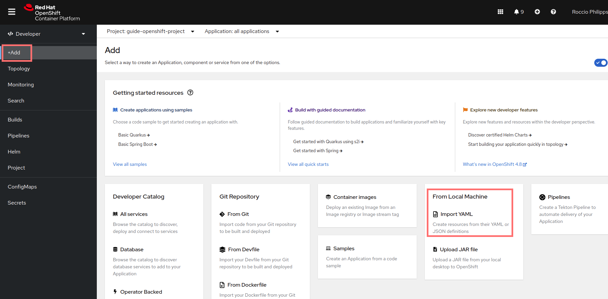
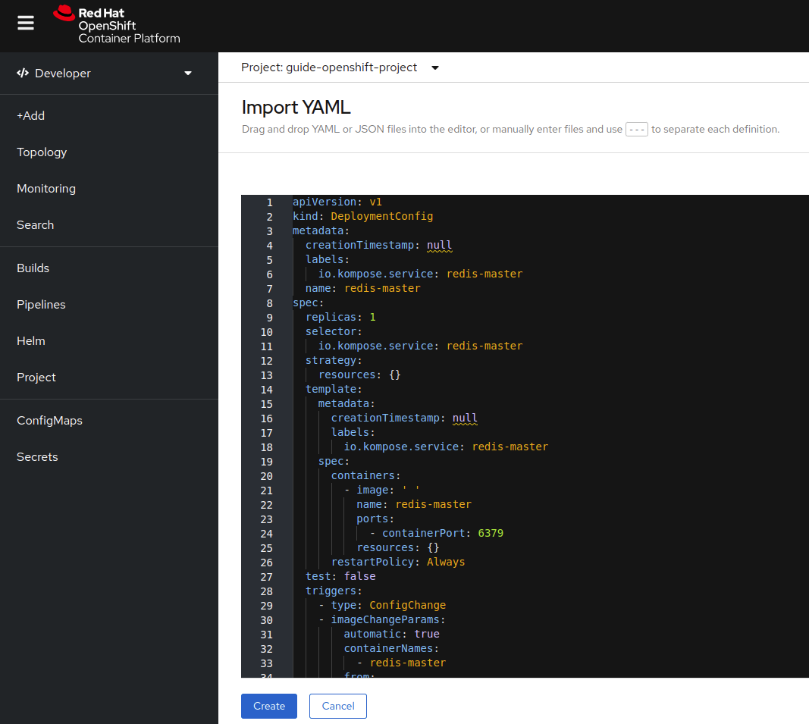
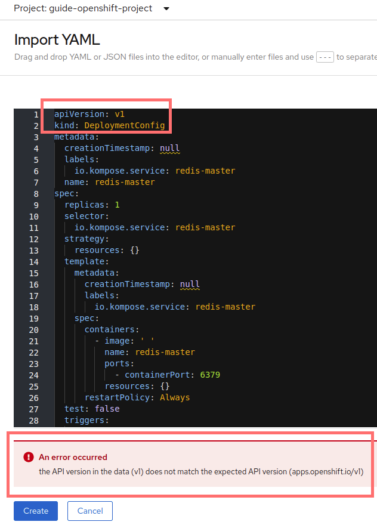

# Kompose

## Introduction

Quand il s'agit des projets multi-module (plusieurs composants), souvent, on doit travailler avec un fichier docker-compose.yaml qui contient l'information nécessaire pour le déploiement des composants d'une manière intégrée dans un environnement conteneurisé.

L'importance de **Kompose** se manifeste quand on veut passer à l'étape de déploiement de nos applications dans un contexte beaucoup mieux géré et orchestré comme kubernetes. Kubernetes aussi permet d'aller plus facilement vers les environnements infonuagiques.

## Kompose: qu’est-ce que c’est?

Kompose est un outil de conversion pour des fichiers docker-compose vers un orchestrateur de conteneurs comme kubernetes ou Openshift.
[Voir site web de kompose](https://kompose.io/)


## Installation

L'installation de kompose dépendra de votre système d'exploitation.
Pour la documentation détaillée, vous pouvez consulter la page web de kompose [ici](https://kompose.io/installation/)
Pour ce guide-ci, on montrera l'installation sur Ubuntu/Debian.

### Ubuntu
On va chercher le paquet debian à partir du [dépôt github](https://github.com/kubernetes/kompose/releases)
```bash
wget https://github.com/kubernetes/kompose/releases/download/v1.26.1/kompose_1.26.1_amd64.deb # Replace 1.26.1 with latest tag
sudo apt install ./kompose_1.26.1_amd64.deb
```
Vous pouvez vérifier l'installation avec "kompose version":
```bash
kompose version
1.26.1 (a9d05d509)
```
## Kompose Convert
Kompose offre soutien pour deux fournisseurs: Openshift et Kubernetes.
On peut spécifier le fournisseur avec l'option globale "provider":
```bash
kompose --provider openshift --file docker-compose.yaml convert
```
Si on ne spécifie pas, par défaut, la conversion se fera pour Kubernetes.

### Exemple de l'utilisation de "kompose convert"
On va suivre l'exemple utilisé dans la page web de kompose [ici](https://kompose.io/getting-started/)

À l'effet de cet exemple, on a besoin simplement du fichier docker-compose qui sera converti en plusieurs fichiers yaml, selon les ressources nécessaires pour le déploiement de l'application. Vous pouvez accéder au fichier docker-compose utilisé dans l'exemple à partir du [lien ici](https://raw.githubusercontent.com/kubernetes/kompose/master/examples/docker-compose.yaml)

```yaml
version: "2"

services:

  redis-master:
    image: k8s.gcr.io/redis:e2e 
    ports:
      - "6379"

  redis-slave:
    image: gcr.io/google_samples/gb-redisslave:v1
    ports:
      - "6379"
    environment:
      - GET_HOSTS_FROM=dns

  frontend:
    image: gcr.io/google-samples/gb-frontend:v4
    ports:
      - "80:80"
    environment:
      - GET_HOSTS_FROM=dns
    labels:
      kompose.service.type: LoadBalancer
```
On observe ici que le fichier docker-compose contient la configuration pour le déploiement de trois composants:
- redis-master
- redis-slave
- frontend

Vous pouvez créer un répertoire où le fichier docker-compose.yaml sera copié

On va exécuter la conversion du fichier pour les deux cas mentionnés de fournisseur: Kubernetes et Openshift

Pour commencer avec l'exemple:
- Créez un répertoire de travail (c.à-d.: monProjetKompose)
- Copiez le fichier docker-compose.yaml dans le répertoire crée.
- Dans un terminal, allez au répertoire crée ("cd <PathAuRepertoire>/monProjetKompose/").

#### Kubernetes (défaut)
Pour une conversion par défaut, simplement utiliser:

```bash
kompose --file docker-compose.yaml convert
```
Vous allez voir un output comme:
```bash
INFO Kubernetes file "frontend-tcp-service.yaml" created 
INFO Kubernetes file "redis-master-service.yaml" created 
INFO Kubernetes file "redis-slave-service.yaml" created 
INFO Kubernetes file "frontend-deployment.yaml" created 
INFO Kubernetes file "redis-master-deployment.yaml" created 
INFO Kubernetes file "redis-slave-deployment.yaml" created 
```
On constate que:
- Six fichiers yaml ont été crées en total.
- Il y a deux fichiers yaml pour chacun de composants: un pour le service et autre pour le déploiement.

Vous pouvez voir en détail les fichiers yaml générés:
- [frontend-tcp-service.yaml](converted-kubernetes/frontend-tcp-service.yaml)
- [redis-master-service.yaml](converted-kubernetes/redis-master-service.yaml)
- [redis-slave-service.yaml](converted-kubernetes/redis-slave-service.yaml)
- [frontend-deployment.yaml](converted-kubernetes/frontend-deployment.yaml)
- [redis-master-deployment.yaml](converted-kubernetes/redis-master-deployment.yaml) 
- [redis-slave-deployment.yaml](converted-kubernetes/redis-slave-deployment.yaml) 

#### Openshift
Pour la conversion du fichier docker-compose.yaml pour Openshift, on spécifie le fournisseur avec l'option "--provider":
```bash
kompose --provider openshift --file docker-compose.yaml convert
```
Vous allez voir un output comme:
```bash
INFO Openshift file "frontend-tcp-service.yaml" created 
INFO Openshift file "redis-master-service.yaml" created 
INFO Openshift file "redis-slave-service.yaml" created 
INFO Openshift file "frontend-deploymentconfig.yaml" created 
INFO Openshift file "frontend-imagestream.yaml" created 
INFO Openshift file "redis-master-deploymentconfig.yaml" created 
INFO Openshift file "redis-master-imagestream.yaml" created 
INFO Openshift file "redis-slave-deploymentconfig.yaml" created 
INFO Openshift file "redis-slave-imagestream.yaml" created 
```

On constate que:
- Neuf fichiers yaml ont été crées en total.
- Il y a trois fichiers yaml pour chacun de composants: un pour le service, autre pour le déploiement et un troisième pour l'image.

Vous pouvez voir en détail les fichiers yaml générés:
- [frontend-tcp-service.yaml](converted-openshift/frontend-tcp-service.yaml)
- [redis-master-service.yaml](converted-openshift/redis-master-service.yaml)
- [redis-slave-service.yaml](converted-openshift/redis-slave-service.yaml)
- [frontend-deploymentconfig.yaml](converted-openshift/frontend-deploymentconfig.yaml)
- [frontend-imagestream.yaml](converted-openshift/frontend-imagestream.yaml)
- [redis-master-deploymentconfig.yaml](converted-openshift/redis-master-deploymentconfig.yaml)
- [redis-master-imagestream.yaml](converted-openshift/redis-master-imagestream.yaml)
- [redis-slave-deploymentconfig.yaml](converted-openshift/redis-slave-deploymentconfig.yaml)
- [redis-slave-imagestream.yaml](converted-openshift/redis-slave-imagestream.yaml)

### Étape finale: Déploiement des composants avec les fichiers yaml de kompose convert
Les fichiers yaml générés à partir d'un fichier docker-compose permettront de déployer les composants dans un environnement conteneurisé comme Kubernetes ou Openshift (basé sur kubernetes).

#### Kubernetes
Pour le déploiement dans un environnement kubernetes, on a besoin de:
- L'installation de l'outil de ligne de commandes pour kubernetes: "kubectl"
  - Instructions pour l'installation [ici](https://kubernetes.io/docs/tasks/tools/)
- Un cluster kubernetes existant
- Être connecté au cluster kubernetes

Pour le déploiement des ressources dans le cluster kubernetes, on doit utiliser la commande: "kubectl apply" avec chacun des fichiers yaml:
```bash
kubectl apply -f redis-master-deployment.yaml
...
```
Vous pouvez vérifier ensuite les ressources créées comme:

- Les services, 
    ```bash
    kubectl get svc
    ```
    exemple d'output:
    ```bash
    NAME           TYPE           CLUSTER-IP       EXTERNAL-IP   PORT(S)        AGE
    frontend-tcp   LoadBalancer   172.30.77.221    <pending>     80:30475/TCP   20m
    redis-master   ClusterIP      172.30.169.211   <none>        6379/TCP       21m
    redis-slave    ClusterIP      172.30.252.50    <none>        6379/TCP       20m
    ```

- Les pods, 
    ```bash
    kubectl get pods
    ```
    exemple d'output:
    ```bash
    NAME                    READY   STATUS      RESTARTS   AGE
    frontend-1-deploy       1/1     Running     0          19m
    redis-master-1-9zjzt    1/1     Running     0          21m
    redis-master-1-deploy   0/1     Completed   0          21m
    redis-slave-1-deploy    0/1     Completed   0          20m
    redis-slave-1-r7mt9     1/1     Running     0          20m
    ```
- Les logs, etc.
    ```bash
    kubectl logs redis-master-1-9zjzt 
    ```

#### Openshift
Pour le déploiement sur openshift on doit utiliser les fichiers yaml générés avec le fournisseur openshift.

:warning: Avant de continuer, il faudrait vérifier la version declaré dans les fichiers yaml générés. [Voir possible-problème-avec-les-fichiers-yaml](#dépannage-possible-problème-avec-les-fichiers-yaml-générés-par-kompose-pour-openshift)

On a deux options pour travailler avec openshift:
- Avec la ligne de commandes "oc cli"
  - Pre-Réquis:
    - Installation de "oc cli" ([voir instructions](../Openshift/README.md#installation-de-oc-cli))
    - Installation de l'outil de ligne de commandes pour kubernetes: "kubectl"
      - Instructions pour l'installation [ici](https://kubernetes.io/docs/tasks/tools/)
    - Un projet existant dans openshift
    - Être loggé au projet openshift ([voir instructions](../Openshift/README.md#se-connecter-au-cluster-dopenshift))
  - Commande pour exécuter un fichier yaml dans le cluster d'openshift:
      ```bash
      oc apply -f frontend-tcp-service.yaml
      ```
- Avec la console web
  - Pour ajouter une ressource avec un fichier yaml dans openshift on peut utiliser l'option "+Add":

    

  - Copiez le contenu du fichier yaml dans la console web et après cliquez sur "Create":
  
    

### Dépannage: Possible problème avec les fichiers yaml générés par kompose pour Openshift
C'est possible que quand vous allez essayer de appliquer le fichier yaml pour la création des ressources dans Openshift, vous ayez des erreurs comme:


  
Pour éviter ces problèmes, vérifiez la valeur de l'apiVersion dans le fichier yaml avant de l'appliquer:

|Fichier yaml Pour|apiVersion Originale|apiVersion Openshift|
--- | --- | --- | 
|Déploiement (DeploymentConfig|v1|apps.openshift.io/v1|
|Image (ImageStram)|v1|image.openshift.io/v1|

Remplacez la valeur "v1" pour la valeur correspondante "apps.openshift.io/v1"

```yaml
apiVersion: apps.openshift.io/v1
kind: DeploymentConfig
```

