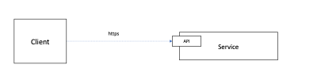
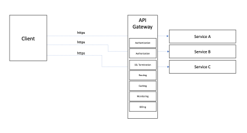
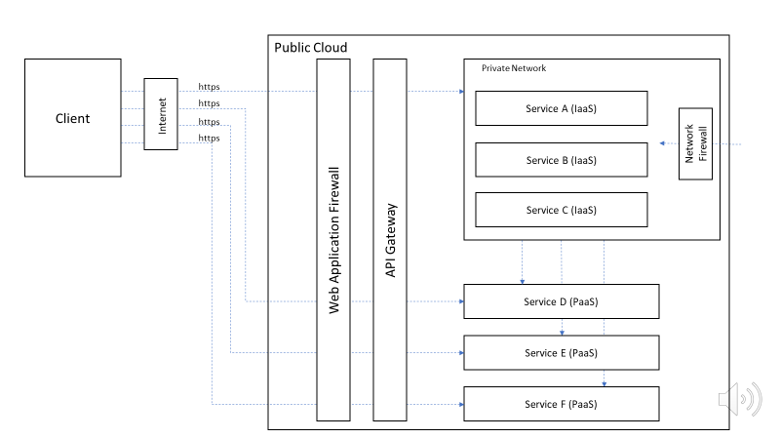
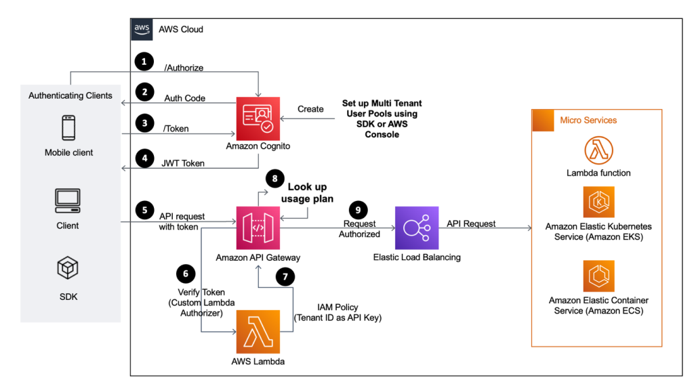

<!-- ENTETE -->

---

    

<!-- FIN ENTETE -->

## Définition
C'est une approche axée sur les API consiste à se concentrer sur la couche applicative pour intégrer les applications et les services sur l'internet.

Les API sont des points de terminaison qui offrent un accès et la mise à jour des informations dans une application. Une application ou un service client prend la place d'un utilisateur avec un navigateur web. Au lieu d'accéder à une interface graphique par le biais d'un portail, un point de terminaison API expose des fonctions permettant d'accéder aux données et de les mettre à jour. C'est pourquoi l'approche privilégiée pour connecter les services en nuage sur l'internet est une approche API. Cette approche maintient la technologie nécessaire à l'échange de données entre les services au niveau de la couche applicative en utilisant des technologies omniprésentes telles que l'internet, https et les services d'identité. 

Étant donné que le réseau, le calcul et le stockage sous-jacents sont gérés par le fournisseur de services en nuage AWS, le CEAI se concentre sur la sécurisation des applications et, par conséquent, des points de terminaison de l'API.

## Modèle 1 : Interfaces de programme d'application (API)

Les API fournissent une architecture moderne pour accéder aux méthodes et aux données dans les applications, les services et les plates-formes. Elles sont omniprésentes pour les services à l'échelle de l'Internet. Les fournisseurs de nuages offrent une suite de services et d'architectures de plateforme pour soutenir une architecture d'API.

## Modèle 2 : API Gateway (Reverse Proxy)

Les capacités communes sont regroupées dans un seul proxy inverse qui constitue une façade pour tous les services. Le client n'interagit pas directement avec chaque service, mais avec une passerelle API qui est un proxy inverse pour tous les services.  Les fournisseurs de services en nuage offrent des capacités de passerelle API en tant que modèle de plate-forme en tant que service (Platform-as-a-Service) où l'infrastructure sous-jacente, y compris le calcul, le stockage et la mise en réseau, est gérée par les fournisseurs de services en nuage. Le schéma ci-dessous suppose un modèle de livraison PaaS pour la passerelle API. La livraison en tant que modèle de service IaaS n'est pas recommandée car elle nécessite une charge opérationnelle plus importante, notamment la gestion des correctifs, la mise à l'échelle et la sécurité des composants de l'infrastructure.

Les passerelles API offrent les capacités suivantes : 

- L'authentification: est le contrôle de la tentative de connexion. Le client fournit des informations d'identification qui sont vérifiées avant que l'accès ne soit accordé. Ces informations d'identification peuvent être en texte brut (non recommandé) ou cryptées. OAuth 2.0 et SAML sont tous deux suggérés dans les procédures obligatoires pour les API.

- L'autorisation consiste à accorder l'accès au service. L'authentification vérifie que la connexion du client est autorisée, l'autorisation vérifie quels services et méthodes sont autorisés par le client. 

- La terminaison SSL est le processus de conversion des informations cryptées du client en texte clair pour le traitement.

- Le routage (Routing) de la connexion du client vers différents services en fonction de l'URL fournie.
Par exemple, https://domain.com/payment acheminera les interactions du client vers le service de paiement, tandis que http://domain.com/cart acheminera les interactions du client vers le service de panier. Ces services peuvent être déployés à l'aide d'architectures complètement différentes, mais les complexités du client sont abstraites car la passerelle API fournit le routage nécessaire.

- Agrégation (Aggregation) de plusieurs appels de service en un seul appel de service. Cela permet de réduire le nombre d'échanges entre le client et les services. 

- La mise en cache (Caching) des méthodes couramment invoquées peut réduire le traitement requis par les services dorsaux tout en améliorant la réponse des clients.  L'expiration du cache peut être définie pour forcer un rafraîchissement du cache. 

- L'équilibrage de la charge (Load balancing) des demandes de service lorsque les performances d'un service ne sont pas dans une fenêtre spécifiée peut être acheminé entre plusieurs instances de ce service. L'équilibrage de la charge est également un moyen efficace de réaliser des déploiements bleu/vert et des déploiements canariens.

- La conversion de protocole permet aux clients d'utiliser un protocole, par exemple HTTP v1 pour faire une demande même si le service n'accepte que HTTP v2.

- La télémétrie de surveillance (Monitoring) est une capacité essentielle pour surveiller et alerter sur la base de mesures de sécurité, financières et de performance.

- La facturation (Billing) de l'utilisation de l'API ou l'imputation des coûts aux utilisateurs en fonction de leur utilisation est un modèle commercial courant.

## Modèle 3 : API Gateway and Network Firewall

Les pare-feu de réseau sont conçus pour protéger l'infrastructure telle que les serveurs, mais pas nécessairement les applications ou les clients.
Les pare-feu réseau se concentrent sur l'inspection du trafic des couches 3 et 4 de l'OSI et n'ont aucune connaissance de HTTP/S et des menaces spécifiques aux applications telles que l'injection SQL et le Cross Site Scripting. Les pare-feu réseau prennent en charge de nombreux protocoles, mais pour les API, le seul protocole utilisé est HTTP/S. 
Pour cela l'ajout d'un pare-feu d'application Web (WAF) offre aux services une plus grande disponibilité tout en protégeant ces services et les clients des menaces courantes. Ce modèle s'appuie sur les capacités d'authentification et d'autorisation d'une passerelle API avec des protections supplémentaires pour les applications et les services pour lesquels la passerelle est un proxy inverse. Les fournisseurs de services en nuage offrent des capacités WAF sous la forme d'un modèle de plate-forme en tant que service (Platform-as-a-Service) où l'infrastructure sous-jacente, y compris l'informatique, le stockage et la mise en réseau, est gérée par les fournisseurs de services en nuage. Le schéma ci-dessous ne s'applique pas lorsque les capacités WAF sont fournies en tant que IaaS.

Les capacités du pare-feu d'application Web sont axées sur la protection contre un grand nombre des 10 principaux risques de sécurité Web de l'OWASP. Un WAF peut augmenter les protections de la passerelle API en fournissant une méthode temporaire pour résoudre les déficiences trouvées dans le code de l'application. Par exemple, si une ancienne application est vulnérable aux injections SQL, le WAF peut être utilisé pour fournir ces protections jusqu'à ce que le code des anciennes applications puisse être remanié.  Pour cette raison, un WAF est plus efficace entre les mains d'un développeur qui connaît le fonctionnement de l'application. Certains diront qu'avec des tests de code appropriés, un WAF n'est pas nécessaire, car les vulnérabilités seront trouvées et corrigées par des tests appropriés. Les WAF, lorsqu'ils sont fournis sous forme de PaaS en nuage, offrent aux développeurs les capacités suivantes :

- Protège contre les attaques par injection SQL.
- Protection contre les scripts intersites.
- Protection contre l'altération des sessions ou des paramètres.
- Permet aux développeurs d'ajouter des inspections spécifiques à une application.
- Inspecte le trafic crypté SSL (HTTPS).
- Protège contre le déni de couche d'application et les attaques par déni de service distribué (DDoS).
- Assure la validation des schémas XML
- Bloque le contenu XML malveillant

### Utilisation l'architecture api dans AWS:

Cet exemple protège les API REST de la plateforme multi-tenant en utilisant:

- [Amazon Cognito](https://aws.amazon.com/fr/cognito) qui contrôle l’authentification des utilisateurs et l’accès aux applications mobiles sur les appareils connectés à Internet. Le service enregistre et synchronise les données de l’utilisateur final, ce qui permet d'ajouter l'authentification à votre API.
- [Amazon API Gateway](https://docs.aws.amazon.com/fr_fr/apigateway/latest/developerguide/welcome.html) qui permet de créer, de publier, de gérer, de surveiller et de sécuriser les API REST, HTTP et WebSocket à n'importe quelle échelle. Les développeurs d'API peuvent créer des API qui accèdent à AWS ou à d'autres services web, ainsi qu'aux données stockées dans le cloud AWS.
- [AWS Lambda](https://aws.amazon.com/fr/lambda) qui vous permet d'exécuter du code sans serveur et vous permet de valider et de décoder le jeton, et extrait l'ID utilisateur du JWT.

L'objectif principal de cet architecture est de simplifier l'ajout de nouvelles fonctionnalités. Le modèle de conception multi-tenant a ouvert de nouveaux défis et de nouvelles opportunités pour les fournisseurs de logiciels grâce à la popularité croissante des architectures de microservices. Le défi dans un environnement multi-tenant est que la charge excessive d'un seul client, en raison de nombreuses requêtes à une API, peut affecter l'ensemble de la plateforme.

Cet exemple protège les API REST des plateformes multi-tenant à l'aide d'Amazon Cognito, Amazon API Gateway et AWS Lambda.

La plateforme multi-tenant qui expose des API REST a des clients tels qu'une application mobile, une application web et des clients API qui consomment les API REST. Nous nous concentrons sur la protection des API REST avec Amazon Cognito comme couche de sécurité pour l'authentification des utilisateurs et l'émission de jetons à l'aide d'OpenID Connect. Le jeton contient les informations d'identité du client, telles que l'ID du locataire auquel les utilisateurs appartiennent. API Gateway étrangle les demandes d'un locataire seulement après le dépassement de la limite définie dans les plans d'utilisation.

1. L'application cliente envoie une requête à Amazon Cognito en utilisant l'API /oauth/authorize ou /login. Amazon Cognito authentifie les informations d'identification de l'utilisateur.
2. Amazon Cognito redirige en utilisant un octroi de code d'autorisation et invite l'utilisateur à entrer des informations d'identification. Après authentification, il renvoie le code d'autorisation.
3. Il transmet ensuite le code d'autorisation pour obtenir un JWT d'Amazon Cognito.
4. Après une authentification réussie, Amazon Cognito renvoie un JWT, tel que acccess_token, id_token, refresh_token. Le jeton access/id stocke des informations sur les permissions accordées, y compris l'ID du locataire auquel cet utilisateur appartient.
5. L'application client invoque l'API REST qui est déployée dans la passerelle API. La demande d'API transmet le JWT comme jeton de porteur dans l'en-tête d'autorisation de la demande d'API.
6. Comme l'identifiant du locataire est caché dans le jeton JWT crypté, la fonction d'autorisation Lambda valide et décode le jeton, et extrait l'identifiant du locataire du JWT.
7. La fonction Lambda token authorizer renvoie une politique IAM ainsi que l'ID du locataire à partir du jeton décodé auquel un utilisateur appartient.
8. L'API REST de l'application est configurée avec des plans d'utilisation par rapport à une API keys personnalisée, qui est l'ID du locataire dans API Gateway. API Gateway évalue la politique IAM et recherche la politique d'utilisation à l'aide de l'API keys. Elle étrangle les demandes d'API si le nombre de demandes dépasse les limites d'étranglement ou de quota de la politique d'utilisation.
9. Si le nombre de demandes d'API est dans la limite, alors API Gateway envoie des demandes à l'API REST de l'application en aval. Cela peut être déployé à l'aide de conteneurs, de Lambda ou d'une instance Amazon EC2.

### Authentification et autorisation
Vous avez besoin d'un pool d'utilisateurs et d'un client d'application activé avec le mécanisme de code d'autorisation pour authentifier les utilisateurs. API Gateway peut vérifier les jetons JWT OAuth par rapport à des pools d'utilisateurs Amazon Cognito uniques. Pour obtenir des informations sur le locataire (ID du locataire), utilisez une fonction d'autorisation Lambda personnalisée dans API Gateway pour vérifier le jeton, extraire l'ID du locataire et le renvoyer à API Gateway.

### Plans d'utilisation d'API Gateway
API Gateway prend en charge la fonction de plan d'utilisation pour les API REST uniquement. Cette solution utilise un point d'intégration comme type d'intégration MOCK. Vous pouvez utiliser le plan d'utilisation pour définir l'accélération et la limite de quota qui sont associées aux API keys. API keys peuvent être générées ou vous pouvez utiliser une key personnalisée. Pour appliquer les plans d'utilisation pour chaque locataire séparément, utilisez l'ID du locataire comme préfixe à une valeur générée de manière unique pour préparer l'API keys personnalisée.

### Configurer la passerelle API pour intégrer l'API keys et le plan d'utilisation
Vous devez activer l'API REST pour utiliser l'API keys et définir la source sur AUTHORIZER. Il existe deux façons d'accepter les API keys pour chaque requête entrante. Vous pouvez la fournir dans le HEADER de la requête entrante ou via une fonction Lambda d'autorisation personnalisée. Cet exemple utilise une fonction Lambda d'autorisation personnalisée pour récupérer l'API keys extraite du JWT reçu par une demande d'API entrante. Les clients ne transmettent que des JWT chiffrés dans l'en-tête d'autorisation de la requête.

Un moyen pratique d'exécuter des microservices consiste à les déployer sous forme de conteneurs Docker et qui permet de réduire les efforts opérationnels pour le déploiement. Avec les conteneurs, la phase d'apprentissage peut être difficile, et vous devez penser à des correctifs de sécurité pour la surveillance et vos images Docker. Amazon Elastic Container Service (Amazon ECS) et Amazon Elastic Kubernetes Service (Amazon EKS) vous évitent de devoir installer, exploiter et mettre à l'échelle votre infrastructure de gestion de clusters. Avec de simples appels d'API, vous pouvez lancer et stopper des applications activées par Docker, interroger l'état complet de votre cluster et accéder à de nombreuses fonctions connues, comme les groupes de sécurité, les répartitions de charge, les volumes Amazon Elastic Block Store (Amazon EBS) et les rôles AWS Identity and Access Management (IAM).
Voici le [lien](./architecture_application_web#Les-raisons-d'utiliser-conteneurs-Docker) afin de vous montrer la raison de pourquoi nous utilisons de conteneurs Docker 

### Amazon ECS 
Prend en charge les stratégies et contraintes de positionnement de conteneurs afin de personnaliser la façon dont Amazon ECS positionne les tâches et y met fin. La contrainte de positionnement d'une tâche est une règle prise en compte lors du positionnement des tâches. Vous pouvez associer des attributs, qui sont des paires clé/valeur, à vos instances de conteneur, puis utiliser une contrainte pour positionner des tâches en fonction de ces attributs. Par exemple, vous pouvez utiliser des contraintes afin de positionner certains microservices en fonction du type d'instance ou de la capacité d'instance, comme les applications alimentées par le GPU.

### Amazon EKS 
S'appuie sur les versions à jour du logiciel open source Kubernetes, ce qui vous permet d'utiliser tous les plug-ins et outils existants de la communauté Kubernetes. Les applications s’exécutant sur Amazon EKS sont entièrement compatibles avec les applications s’exécutant sur n’importe quel environnement Kubernetes standard, qu’il s’agisse de centres de données sur site ou de clouds publics. Amazon EKS intègre IAM dans Kubernetes, vous permettant ainsi d’enregistrer les entités IAM avec le système d’authentification natif de Kubernetes. Il n'est pas nécessaire de configurer manuellement les informations d'identification pour l'authentification auprès du plan de contrôle Kubernetes. 

Vous pouvez aussi utiliser votre keycloak SSO au lieu de AWS Cognito, voici le [lien](https://github.com/CQEN-QDCE/ceai-cqen-deployments/tree/main/admin-api) d'un déploiement qui a été fait au milieu de notre organisation (CEAI)

