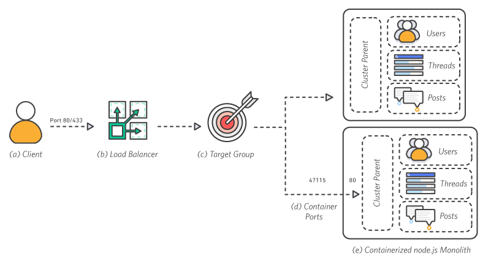

<!-- ENTETE -->

---

    

<!-- FIN ENTETE -->

# Architecture d'application Web

## Définition

Nous ulitisons cette architecture pour créer un site web sécurisé pour votre nom 
de domaine enregistré. Avec cette approche, nous allons vous présenter deux 
modèles qui sont utilisés au CEAI et qui utilisent des conteneurs Docker.

Les conteneurs vous permettent de regrouper facilement le code, les 
configurations et les dépendances d'une application dans des services modulaires 
simples d'utilisation. Ces derniers assurent la cohérence, l'efficacité des 
opérations et une meilleure productivité, tout en rendant possible le contrôle 
de version. Grâce aux conteneurs, les applications se déploient de manière 
rapide, fiable et constante, quel que soit l'environnement.

## Les raisons d'utiliser conteneurs Docker

### Rapidité
En cas de nouveau code, le lancement d'un conteneur n'implique pas d'opérations 
complexes. Ainsi, les opérations s'accélèrent car ce code, intégré à un 
conteneur se trouvant sur la machine locale d'un développeur, peut être aisément 
transféré sur un serveur de test. Lors de sa création, ce conteneur peut être 
associé aux autres conteneurs nécessaires à l'exécution de la pile 
d'applications.

### Contrôle des dépendances et pipeline optimisé
Une image de conteneur Docker constitue la capture, à un moment précis, du code 
et des dépendances d'une application. Grâce à elle, il est possible de mettre en 
place un processus standard. Par exemple :

#### Les développeurs créent et exécutent le conteneur localement
Le serveur d'intégration continue exécute le même conteneur et le soumet à des 
tests d'intégration afin de s'assurer qu'il est conforme aux besoins.
Le conteneur est transféré dans un environnement de simulation où son 
fonctionnement peut être vérifié à l'aide de tests de charge, ou manuels.
Le conteneur est envoyé en production.
Le fait de pouvoir créer, tester, transférer et exécuter le même conteneur au 
cours de chaque étape du pipeline d'intégration et déploiement permet d'obtenir, 
bien plus facilement, une application fiable et de haute qualité.

#### Optimisation des ressources et ajustement des processus
Les conteneurs assurent l'optimisation des ressources car ils permettent 
d'exécuter plusieurs processus distincts au sein d'un seul système. Les méthodes 
d'isolation et d'attribution qui caractérisent les conteneurs contribuent à 
cela. Par ailleurs, il est possible d'appliquer certaines restrictions afin que 
les conteneurs n'exploitent qu'une certaine part de la mémoire et du processeur 
d'un hôte. Une fois que vous savez de quelles ressources un conteneur a besoin, 
et lesquelles sont disponibles auprès du serveur hôte sous-jacent, vous pouvez 
adapter la taille des ressources de calcul que vous exploitez avec des hôtes 
d'envergure moindre, ou encore augmenter la densité des processus s’exécutant 
sur un seul hôte de plus large envergure. De cette façon, la disponibilité 
s'accroît et l'emploi des ressources est adapté au mieux.

### Flexibilité
La flexibilité des conteneurs Docker est due à leur portabilité, à la simplicité 
de leur déploiement et à leur taille réduite. Les services conteneurisés peuvent 
être déplacés aisément entre les hôtes, sans qu’ils ne soient affectés par les 
anomalies d'autres services adjacents, ni par l’action inadéquate des correctifs 
et des mises à niveau du système hôte. Une machine virtuelle requiert quant à 
elle des opérations d'installation et de configuration. 

L'architecture sans serveur est un moyen de créer et d'exécuter des applications 
et des services sans avoir à gérer l'infrastructure.

Serverless est idéal pour permettre une livraison rapide et continue des 
logiciels. Vous n'avez pas à penser à la gestion de l'infrastructure, au 
provisionnement ou à la planification de la demande et de la mise à l'échelle.

C'est un moyen efficace de promouvoir les meilleures pratiques, des solutions robustes.

## Modèle 1: Monolithique

Les architectures monolithiques classiques sont difficiles à mettre à l'échelle. 
A mesure de la croissance de la base de code d'une application, elle devient 
complexe à mettre à jour et à maintenir. L'introduction de nouvelles fonctions, 
de langues, d'infrastructures et de technologies devient très délicate, ce qui 
limite l'innovation et les nouvelles idées.

### Présentation de l'architecture

Toute l'application node.js s'exécute dans un conteneur sous la forme d'un 
service unique et chaque conteneur a les mêmes fonctions que tous les autres. Si 
une fonction de l'application enregistre un pic de demande, toute l'architecture 
doit être mise à l'échelle.

- a. Client:

Le client adresse une demande sur le port 80 à l'équilibreur de charge.

- b. Équilibreur de charge:

L'équilibreur de charge répercute les demandes sur tous les ports disponibles.

- c. Groupes cibles:

Les instances sont enregistrées dans le groupe cible de l'application.

- d. Ports de conteneurs:

Chaque conteneur exécute un processus d'application unique qui lie le parent du 
cluster node.js au port 80 dans son espace de noms.

- e. Monolithe du node.js conteneurisé:

Le parent du cluster node.js est responsable de la distribution du trafic aux 
travailleurs au sein de l'application monolithique. Quoique conteneurisée, cette 
architecture reste monolithique, car chaque conteneur présente les mêmes 
caractéristiques que les autres.

## Modèle 2: Microservices

Les microservices s'intègrent dans une approche architecturale et 
organisationnelle du développement logiciel créée pour accélérer les cycles de 
déploiement, à favoriser l'innovation et l'appropriation, à améliorer la 
maintenabilité et la capacité de mise à l'échelle des applications logicielles 
et à faire évoluer les organisations qui fournissent des logiciels et des 
services en utilisant une approche agile qui aide les équipes à travailler 
indépendamment. Avec cette approche basée sur les microservices, les logiciels 
sont constitués de petits services qui communiquent via des API bien définies 
qui peuvent être déployés indépendamment. Ces services sont la propriété de 
petites équipes autonomes. Cette approche agile est la clé de la mise à 
l’échelle réussie de votre organisation.

Un moyen pratique d'exécuter des microservices consiste à les déployer sous 
forme de conteneurs Docker. Les conteneurs Docker sont rapides à approvisionner, 
facilement portables et offrent une isolation des processus. 

#### Isolement des défaillances
Avec le modèle de microservices, seule une partie de votre service est indisponible si un un micro-élément de votre service tombe en panne. Donc vous pouvez configurer des microservices pour limiter l'impact de telles situations. 

#### Isolement de chaque service
Dans une application monolithique, si l'une des fonctions est victime d'une 
faille de sécurité (permettant, par exemple, qu'un code soit exécuté à distance, 
il est probable que le cybercriminel qui en est à l'origine soit aussi en mesure 
d'accéder à chaque autre service de votre système. Ceci peut se révéler 
particulièrement dangereux et provoquer, notamment, l'exploitation non autorisée 
d'une base de données renfermant des mots de passe.

#### Mise à l'échelle indépendante
Lorsque des fonctions sont réparties au sein de microservices, la part de 
l'infrastructure et le nombre d'instances utilisées par chaque classe de 
microservices peuvent être mis à l'échelle de façon indépendante. Il est donc 
plus simple d'estimer le coût d'une fonctionnalité spécifique, ainsi que 
d'identifier les fonctionnalités dont l'optimisation est nécessaire. Si les 
ressources de l'une d'elles présentent un problème, les autres ne sont pas 
affectées et les performances demeurent assurées.

#### Développement rapide
Les microservices garantissent une réduction des risques lors du développement, 
ce qui offre à une équipe la possibilité de créer plus rapidement des 
applications. Dans un monolithe, l'ajout d'une nouvelle fonctions peut 
potentiellement avoir une incidence sur toutes les autres. Les développeurs 
doivent bien prendre en compte l'impact de n'importe quel code ajouté, et 
s'assurer que tout s'effectue correctement. Par ailleurs, l'application d'un 
nouveau code à une fonctionnalité concerne uniquement le microservice associé. 
Les développeurs peuvent être sûrs que tout code écrit n'influe pas sur celui 
des autres microservices, sauf si une connexion est explicitement établie entre 
deux microservices.

### Utilisation de l'architecture application web dans AWS:

L'infrastructure est composée des ressources suivantes :

#### Infrastructure de back-end : 
Contient un registre `AWS ECR`, une définition de tâche, un cluster `AWS ECS`, 
un service `AWS ECS` associé à un groupe cible et un équilibreur de charge 
applicatif, un certificat SSL et un enregistrement A backend pointant vers 
l'équilibreur de charge. Le service `ECS` est configuré avec un service 
autoscaling (Target Tracking Autoscaling qui s'adapte en fonction des demandes 
de l'ALB par cible).

- [Amazon Elastic Container Registry (Amazon ECR)](https://aws.amazon.com/fr/ecr)
 ou vous allez créer l'image de conteneur Docker destinée à votre 
application monolithique.

- [Amazon Elastic Container Service (Amazon ECS)](https://aws.amazon.com/fr/ecs) 
qui un service de gestion de conteneurs hautement évolutif et à hautes 
performances qui prend en charge les conteneurs Docker et vous permet d'exécuter 
facilement des applications. Grâce à de simples appels d'API, vous pouvez lancer 
et arrêter les applications activées par des conteneurs Docker, connaître l'état 
complet de votre cluster et accéder à de nombreuses fonctionnalités courantes 
telles que les groupes de sécurité, Elastic Load Balancing, les volumes EBS et 
les rôles `IAM`.

- [AWS Fargate](https://aws.amazon.com/fr/fargate) : AWS Fargate est une 
technologie pour `Amazon ECS` qui vous permet d'exécuter des conteneurs sans 
avoir à gérer des serveurs ou des clusters. Avec `AWS Fargate`, vous n'avez plus 
besoin de provisionner, configurer et mettre à l'échelle des clusters de 
machines virtuelles pour exécuter des conteneurs. Vous n'avez donc plus besoin 
de choisir des types de serveurs, de décider quand faire évoluer vos clusters ou 
d'optimiser le regroupement des clusters.
Avec AWS Fargate, vous n'avez plus besoin d'interagir avec les serveurs ou les 
clusters, ni d'y réfléchir. Fargate vous permet de vous concentrer sur la 
conception et la réalisation de vos applications au lieu de gérer 
l'infrastructure qui les exécute.

- [L'Équilibreur de charge d'application (ALB)](https://aws.amazon.com/fr/
elasticloadbalancing/application-load-balancer) permet à votre service 
d'accepter le trafic entrant. L'ALB achemine automatiquement le trafic vers des 
instances de conteneurs fonctionnant sur votre cluster en les utilisant comme 
groupe cible.

### Infrastructure de front-end : 

- [Amazon Simple Storage Service (Amazon S3)](https://aws.amazon.com/fr/s3): 
Pour stocker les fichiers statiques dans `S3` front-end par une distribution 
Cloudfront. L'application utilise également des services `REST` hébergés sur `AWS ECS`.

- [Le service web de diffusion de contenu Amazon CloudFront](https://docs.aws.amazon.com/fr_fr/cloudfront/index.html): Cette solution crée une distribution 
CloudFront pour servir votre site Web aux internautes.

> Il est fortement recommandé d'ajouter un [AWS WAF](https://aws.amazon.com/fr/
waf) à votre solution.

Voici le [lien](https://github.com/CQEN-QDCE/ceai-cqen-deployments/tree/main/
 d'un déploiement qui a été fait au milieu de notre organisation (CEAI)