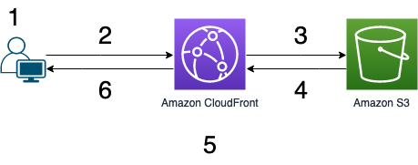

<!-- ENTETE -->

---

    

<!-- FIN ENTETE -->

## Définition

Utilisez cette solution pour créer un site web statique sécurisé pour votre nom de domaine enregistré.

Un site web statique diffuse le contenu dans le même format que celui dans lequel il est stocké. Aucune exécution de code serveur n'est nécessaire. Par exemple, si un site web statique est constitué de documents HTML
affichant des images, il fournit le HTML et les images tels quels au navigateur, sans modifier le contenu des fichiers.
Les sites web statiques peuvent être fournis aux navigateurs web sur des ordinateurs de bureau, des tablettes ou des appareils mobiles.
Ils se composent généralement d'un mélange de documents HTML, d'images, de vidéos, de feuilles de style CSS et de fichiers JavaScript.
les sites statiques peuvent également offrir une interactivité côté client. En utilisant HTML5 et les technologies JavaScript côté client telles que jQuery, AngularJS, React et Backbone, vous pouvez proposer des expériences utilisateur riches, attrayantes et interactives.

Dans une architecture traditionnelle, les serveurs web diffusent un contenu statique. En général, le contenu est géré à l'aide d'un système de gestion de contenu (CMS), et plusieurs sites statiques sont hébergés sur la même infrastructure. Le contenu est stocké sur des disques locaux ou sur un partage de fichiers sur un réseau accessible.
L'exemple suivant montre un exemple de structure de structure du système.

├─ css/
│ ├─ main.css
│ └─ navigation.css
├─ images/
│ ├─ banner.jpg
│ └─ logo.jpg
├─ index.html
├─ scripts/
│ ├─ script1.js
│ └─ script2.js
├─ section1.html
└─ section2.html

## Modèle: Site statique

Ce modèle propose de déployer le contenu statique vers un service de stockage en nuage qui peut le livrer directement au client. Ce modèle peut réduire le besoin d'instances de calcul potentiellement coûteuses.

Dans la plupart des environnements d'hébergement en nuage, il est possible de minimiser les besoins en instances de calcul (par exemple, en utilisant une instance plus petite ou moins d'instances), en plaçant certaines des ressources et des pages statiques d'une application dans un service de stockage. Le coût du stockage hébergé dans le nuage est généralement bien inférieur à celui des instances de calcul.

Lorsque l'on héberge certaines parties d'une application dans un service de stockage, les principales considérations sont liées au déploiement de l'application et à la sécurisation des ressources qui ne sont pas destinées à être accessibles à des utilisateurs anonymes.

Ce modèle convient parfaitement pour :

1. Minimiser le coût d'hébergement des sites Web et des applications qui contiennent quelques ressources statiques.
2. Minimiser les coûts d'hébergement des sites Web qui ne contiennent que du contenu et des ressources statiques. Selon les capacités du système de stockage de l'hébergeur, il peut être possible d'héberger un site Web entièrement statique dans son intégralité dans un compte de stockage.
3. Exposer des ressources et du contenu statiques pour des applications fonctionnant dans d'autres environnements d'hébergement ou sur des serveurs sur site.
4. Localiser le contenu dans plus d'une zone géographique en utilisant un réseau de diffusion de contenu qui met en cache le contenu du compte de stockage dans plusieurs centres de données à travers le monde.

### Utiliser ce patterne sur AWS:

Pour convertir un environnement d'hébergement traditionnel en une architecture AWS, vous pouvez utiliser une approche "lift-and-shift" dans laquelle vous substituez les services AWS au lieu d'utiliser l'environnement traditionnel.
Dans cette approche, vous pouvez substituer les services AWS suivants :

[Amazon Simple Storage Service (Amazon S3)](https://aws.amazon.com/fr/s3/) permet d'héberger des sites web statiques sans avoir besoin d'un serveur web. Le site web est hautement performant et évolutif pour une fraction du coût d'un serveur web traditionnel. Amazon S3 est un service de stockage pour le cloud, qui vous fournit un stockage objet sécurisé, durable et hautement évolutif, durable et hautement évolutif. 
Cette solution crée un Bucket S3 qui héberge les ressources de votre site Web statique. Le site Web est uniquement accessible via CloudFront, et non directement depuis S3.

[Le service web de diffusion de contenu Amazon CloudFront](https://docs.aws.amazon.com/fr_fr/cloudfront/index.html) s'intègre à d'autres produits AWS pour vous offrir un moyen simple de distribuer du contenu aux utilisateurs de votre site Web avec une faible latence, des vitesses de transfert de données élevées et sans engagement d'utilisation minimale.
Les sites périphériques d'Amazon CloudFront mettent en cache le contenu d'un serveur d'origine et livrent ce contenu en cache à l'utilisateur. Les utilisateurs suivants qui demandent le même contenu à partir de cet emplacement périphérique bénéficient d'un chargement de page plus rapide, car ce contenu est déjà mis en cache.
Cette solution crée une distribution CloudFront pour servir votre site Web aux internautes. La distribution est configurée avec [une identité d'accès d'origine](https://docs.aws.amazon.com/fr_fr/AmazonCloudFront/latest/DeveloperGuide/private-content-restricting-access-to-s3.html) CloudFront pour s'assurer que le site Web est uniquement accessible via CloudFront, et non directement depuis S3. La distribution est également configurée avec [une politique d'en-tête de réponse CloudFront](https://docs.aws.amazon.com/fr_fr/AmazonCloudFront/latest/DeveloperGuide/adding-response-headers.html) qui ajoute des en-têtes de sécurité à chaque réponse.
Et en plus cette solution crée une distribution CloudFront pour diffuser votre site web auprès des utilisateurs avec une faible latence. 

[Amazon Route 53](https://aws.amazon.com/fr/route53/) Lors de la création d'une distribution Amazon CloudFront, spécifiez votre réseau Amazon S3 comme serveur d'origine. La distribution Amazon CloudFront possède elle-même un DNS. Vous pouvez y faire référence en utilisant un CNAME si vous avez un nom de domaine personnalisé. Pour faire pointer l'enregistrement A d'un domaine racine vers une distribution Amazon CloudFront, vous pouvez utiliser des enregistrements d'alias Amazon Route 53, comme illustré dans le diagramme suivant.

[ACM](https://aws.amazon.com/fr/certificate-manager/)
Cette solution crée un certificat SSL/TLS dans ACM et l'attache à la distribution CloudFront. Cela permet à la distribution de servir le site Web de votre domaine en utilisant HTTPS.

1. L'utilisateur demande le site Web à l'adresse www.example.com.
2. Si l'objet demandé est dans le cache, CloudFront renvoie l'objet de son cache à l'utilisateur.
3. Si l'objet n'est pas dans le cache de CloudFront, CloudFront demande l'objet à l'origine (un seau S3).
4. S3 renvoie l'objet à CloudFront
5. CloudFront met l'objet en cache.
6. L'objet est renvoyé à l'utilisateur. Les réponses ultérieures pour l'objet sont servies à partir du cache de CloudFront.

